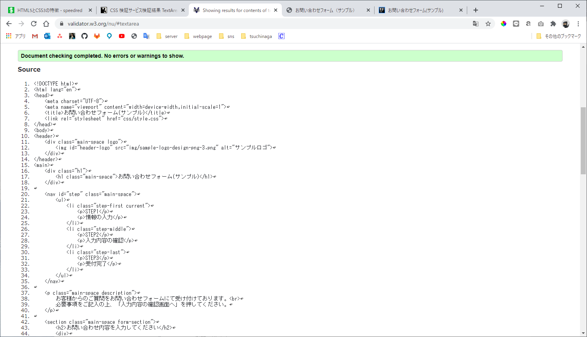
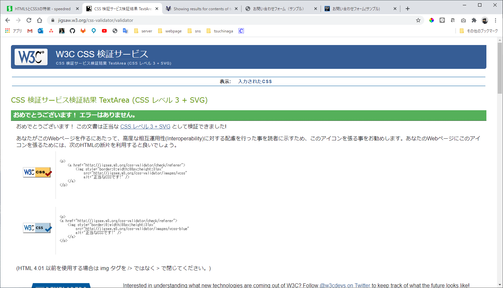

# html5 css3

## HTML5・CSS3とそれまでのHTML・CSSの違い
### HTML5までどんな課題があって、何を解決するためにHTML5が出たのか
HTMLはHyper Text Markup Languageの頭文字をとったもので、名前の通りマークアップ言語です。
マークアップ言語はドキュメントを装飾する目的で作られた記法であるためドキュメントの装飾だけできていればそれでよかったのですが、クライアントのマシンスペックの向上やブラウザの機能追加などでリッチな表現を行なうことができるようになってきました。
その際に積極的に採用されたのがFlashですが、脆弱性などの問題により使いたがらないユーザが増え、Flashに依存せずにリッチなUIを提供する方法が求められました。
さらにはスマートフォンの登場もありデバイスの差異を吸収できる方法が強く求められていました。
他にもHTML4は構造に意味を求められなかったため、人間が読むには優しくない作りになっていました。

これらの問題を解決するために策定されたのがHTML5とCSS3です。

### HTML5になって失われたものはあるか
問題の解決、もしくは代替手段があるものが廃止されただけであるため、失われたものは特にない。強いて言うなら後方互換性は失われているかも。

* 表現のためのタグはCSSに役割が委譲され廃止された
    * font, centerなど
* ユーザビリティ、アクセシビリティ―を損なうタグが廃止された
    * frame, framesetなど
* 頻繁に使用されない、混乱を生じる、機能が他の要素で扱えるタグの廃止
    * isindex, dirなど

タグ以外にもいくつもの属性が置き換えられています

またHTML4では全てのタグはどのタグの配下にもおけましたが、HTML5により厳格性が増したことでどこにでも置けるということはなくなりました。
よくあるのはインライン要素である``の下にブロック要素である`div`をおくといったことができなくなりました。

## ブラウザ毎の対応状況
### ブラウザによって差異はあるのか
新しいAPIは提案され続けているので、どのブラウザも全ての機能を網羅しているということは絶対にないです。

ブラウザ毎で対応状況が完全に一致する場合があります。それはレンダラーが同じ場合です。HTMLやCSS、JavaScriptを理解してレンダリングしてくれているのはブラウザの中にあるレンダラーで、このレンダラーが同じで備えている機能は同じになります。
ただし、レンダラーはおなじでもブラウザ毎に持っている機能は違うことがあります。Google Chromeがブラウザでログインできるとか。これはHTML5に関係ないですけど。

ちなみにですが、Edge、FireFox、Chromeは比較的多くのAPIに対応していますが、Safariは安定して対応しているとは言い難い状況です。

### 差異がある場合は、何故差異があるのか
先の項でも触れましたが、レンダラーが違うからです。
ではレンダラー毎の機能の差はどこからくるのか。それはレンダラーの開発の活発さとしか言えない気がしますね……。

たとえばGoogle Chromeで使われているChromiumはBlinkというレンダラーが使われていますが、Googleが関わっているだけあって新しい機能を取り込むのに積極的です。
FireFoxもWebに力をいれていますしLinux界隈から登場しただけあってキャッチアップが早いです。
Safariは、まあ、マイペースに進んでいるからいいんじゃないですかね。

## 次のHTML(HTML6)とCSSはいつ来ていつから使われるのか
次のHTMLの名前が何かというのはおいといて、常に新しい仕様は策定されていて、各ブラウザはそれに対応し続けています。
なので、日に日に次のHTMLはきています。HTMLというか主にはAPIで、JavaScriptに関係する部分が大半ではありますが。

昨年まではW3Cが積極的に行ってきた仕様策定はWHATWGに移されました。WHATWGが新しい仕様を策定し、各ブラウザがそれに追従することで新しいHTMLとCSSが出続け、使われ続けます。

## 参考
* [HTML5 Differences from HTML4（HTML4からのHTML5の差分）](https://momdo.github.io/html5-diff/)
* [「HTML 4.01」と「XHTML 1.0」と「HTML5」の違いまとめ フラップイズム](https://www.flapism.jp/html/107/)
* [マークアップ言語 (markup language)とは｜「分かりそう」で「分からない」でも「分かった」気になれるIT用語辞典](https://wa3.i-3-i.info/word1578.html)
* [HTML 4との違い、HTML5で可能になること－HTML5リファレンス](http://www.htmq.com/html5/002.shtml)
* [Can I use... Support tables for HTML5, CSS3, etc](https://caniuse.com/)
* [Mobile HTML5 compatibility on iPhone, Android, Windows Phone, BlackBerry, Firefox OS and other mobile devices](http://mobilehtml5.org/)
* [HTMLレンダリングエンジン - Wikipedia](https://ja.wikipedia.org/wiki/HTML%E3%83%AC%E3%83%B3%E3%83%80%E3%83%AA%E3%83%B3%E3%82%B0%E3%82%A8%E3%83%B3%E3%82%B8%E3%83%B3)
* [HTML Standard 日本語訳](https://momdo.github.io/html/)

## 模写

対象ページ: [お問い合わせフォーム（サンプル）](https://req.qubo.jp/qubo/form/KZTxekEm)

### HTML Checker

### CSS Checker

